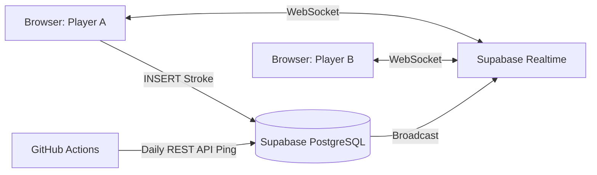

# Draw-Relay (ドロー・リレー)

## 概要

**「みんなでつなぐ、お絵描きリレー」**
Draw-Relayは、2〜8人の友達や家族とリアルタイムで協力しながら一つのお題の絵を完成させる、パーティー向けのお絵描きリレーウェブアプリケーションです。アカウント作成不要で、4桁のルームコードを共有するだけですぐに遊ぶことができます。

## 開発の背景・経緯

Next.js を用いたウェブアプリケーション開発の練習作品として、何か面白いゲームを作ろうと考え、お絵描きゲームを企画しました。
既存の有名なお絵描き伝言ゲーム（ガーティックフォンなど）を参考にしつつ、「お題を絵にし、絵をお題にする」という伝言形式から「全員で協力して1つのキャンバスに順番に描き足していく」という形式にすることで、絵の得手不得手を問わずによりカオスで予測不能な面白さが生まれるのではないかと考え、本アプリの企画・開発に至りました。
「複数人でのリアルタイム同期」と「キャンバスへの確実な描画データの保存・反映」という技術的課題の解決を目標に据えています。

## 公開URL

https://drawrelay.vercel.app/

## 特徴と機能の説明

- **リアルタイムな描画の同期 (Supabase Realtime)**
  - 誰かがCanvasに線を描いてペンを離した瞬間、同じ部屋にいる他プレイヤーの画面にもその線が同期されます。

- **3つのユニークなプレイスタイル（ゲームモード）**
  - **ノーマルモード:** 用意されたランダムなお題、または自由入力のお題に対し、各プレイヤーが順番に描き足していきます。
  - **1人1色モード:** 各プレイヤーがゲーム開始時に自分の「担当カラー」を1色選び、その色だけを使って絵を完成させます。（次の周回で色を変える機能も搭載）
  - **いつどこでだれが何をしたモード:** プレイヤー人数に応じて「いつ」「どこで」「だれが」「何をした」などのカテゴリが秘密裏に割り当てられ、各々がお題（プロンプト）を設定します。描く順番が回ってきた人にだけそのカテゴリのお題が明かされていく、カオスなお絵描きリレーです。

- **直感的でモダンなUIデザイン (Glassmorphism)**
  - Tailwind CSS を活用し、半透明なすりガラス風UI（グラスモーフィズム）やアニメーションを採用。ポップで親しみやすい画面デザインにこだわりました。

---

## 使用技術 (技術スタック)

### フロントエンド

- **TypeScript**
- **Next.js (App Router)**
- **Tailwind CSS**
- **Lucide React**
- **HTML5 Canvas API**

### バックエンド・データベース

- **Supabase** (BaaS)
  - **PostgreSQL**: ルームの管理、ユーザーの一時情報、ストローク（描画）の点群パスデータの保存
  - **Supabase Realtime (WebSockets)**: 描画データや参加者ステータスのリアルタイム同期

### 開発・運用ツール

- **Antigravity** (エディタ)
- **GitHub** (ソースコード管理 / バージョン管理)
- **GitHub Actions** (稼働維持用スクリプト：Supabaseが「停止モード」にならないよう毎日自動でPingを送信するCI/CD設定)
- **Vercel** (ホスティング・デプロイ)

### システム構成図

---

## 開発期間・体制

- **開発体制**: 個人開発
- **開発期間**: 2026/02/22 ~ 2026/02/23 (約 10 時間)

---

## 工夫した点・苦労した点

- **Canvas API と データベースのシームレスな連携**
  Canvas上で描かれた線を単なる画像（Base64等）として保存するのではなく、「X,Y座標の配列（パスデータ）」と「色」のJSONBデータとしてSupabaseに保存する仕組みを構築しました。これにより、途中から部屋に入ったプレイヤーの画面にも正確に過去のストロークを描画（復元）することが可能になっています。
- **排他制御とターン管理のリソース同期**
  「今は誰のターンか」というステートと、「3秒のインターバル」を各クライアント間でズレなく、かつホスト主導で安全にDBを更新し同期させる実装に苦労しました。
- **GitHub Actions による停止モード回避策**
  Supabaseの無料枠による「7日間アクセスがない場合の停止モード」を回避するため、単発のデプロイだけでなく、GitHub Actionsを用いて毎日自動でAPIにPing（GETリクエスト）を投げる運用保守周りの自動化も行いました。

---

## 既知の課題と今後の展望

- **再プレイ時にバグが発生しやすい**
  再プレイのボタンを押下してホーム画面に戻ったあと、部屋を作成しようとするときに、おそらくdb上に部屋のデータが残っていることが原因で部屋を作成できない場合がある。
  今後はこの改善も行っていきたい。
- **リプレイ機能**
  保存されているストロークの時系列データ（`created_at`）を活用し、最初からどのように絵が描き足されていったかを動画のように再生するリプレイ機能を実装していきたいです。
