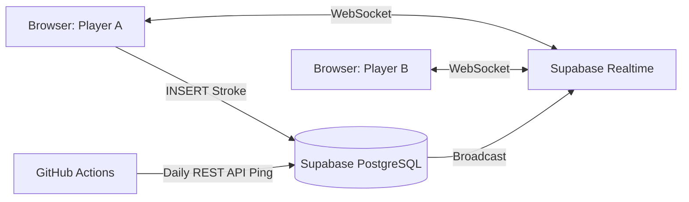

# Draw-Relay (ドロー・リレー)

## 概要

**「みんなでつなぐ、お絵描きリレー」**
Draw-Relayは、2〜8人の友達や家族とリアルタイムで協力しながら一つのお題の絵を完成させる、パーティー向けのお絵描きリレーウェブアプリケーションです。アカウント作成不要で、URL（4桁のルームコード）を共有するだけですぐに遊ぶことができます。

## 開発の背景・経緯

Next.js を用いたウェブアプリケーション開発の最終課題として、完全オリジナルのリアルタイム通信アプリに挑戦しました。
既存の有名なお絵描き伝言ゲーム（ガーティックフォンなど）は「お題を絵にし、絵をお題にする」という伝言形式が主流ですが、「**全員で協力して1つのキャンバスに順番に描き足していく**」という形式があれば、絵の得手不得手を問わずによりカオスで予測不能な面白さが生まれるのではないかと考え、本アプリの企画・開発に至りました。
「複数人でのリアルタイム同期」と「キャンバスへの確実な描画データの保存・反映」という技術的課題の解決を目標に据えています。

## 公開URL

[公開URLをここに記載してください (例: https://draw-relay.vercel.app/)]

---

## 特徴と機能の説明

本アプリは、ブラウザでのリアルタイム通信を活用したスムーズなお絵描き体験を提供します。

- **アカウント不要で即プレイ可能**
  - セッションストレージを用いた簡易的なユーザー識別を採用しており、面倒なユーザー登録やログインは一切不要です。（認証・ログインが必要なアプリというルールではありませんが、手軽さを優先しました。）

- **リアルタイムな描画の同期 (Supabase Realtime)**
  - 誰かがCanvasに線を描いてペンを離した瞬間、同じ部屋にいる他プレイヤーの画面にもその線が同期されます。

- **3つのユニークなプレイスタイル（ゲームモード）**
  - 🎨 **ノーマルモード:** 用意された70種類以上のお題（「かんたん」「むずかしい」からランダム選択、または自由入力）に対し、各プレイヤーが自由な色で10秒ずつ描き足していきます。
  - 🌈 **1人1色モード:** 各プレイヤーがゲーム開始時に自分の「担当カラー」を1色選び、その色だけを使って絵を完成させます。（次の周回で色を変える機能も搭載）
  - 🎲 **いつどこでだれが何をしたモード:** プレイヤー人数に応じて「いつ」「どこで」「だれが」「何をした」などのカテゴリが秘密裏に割り当てられ、各々がお題（プロンプト）を設定します。描く順番が回ってきた人にだけそのカテゴリのお題が明かされていく、カオスなお絵描きリレーです。

- **直感的でモダンなUIデザイン (Glassmorphism)**
  - Tailwind CSS を活用し、半透明なすりガラス風UI（グラスモーフィズム）やアニメーションを採用。ポップで親しみやすい画面デザインにこだわりました。

---

## 使用技術 (技術スタック)

### フロントエンド

- **TypeScript** (厳格な型定義と安全な開発)
- **Next.js (App Router)** (Reactフレームワーク。ルーティングとUI構築)
- **Tailwind CSS** (スタイリング・UIコンポーネントの構築)
- **Lucide React** (軽量かつモダンなSVGアイコン)
- **HTML5 Canvas API** (お絵描き機能のコア実装)

### バックエンド・データベース

- **Supabase** (BaaS)
  - **PostgreSQL**: ルームの管理、ユーザーの一時情報、ストローク（描画）の点群パスデータの保存
  - **Supabase Realtime (WebSockets)**: 描画データや参加者ステータスのリアルタイム同期

### 開発・運用ツール

- **VSCode** (エディタ)
- **GitHub** (ソースコード管理 / バージョン管理)
- **GitHub Actions** (稼働維持用スクリプト：Supabaseが「停止モード」にならないよう毎日自動でPingを送信するCI/CD設定)
- **Vercel** (ホスティング・デプロイ)

### システム構成図

---

## 開発期間・体制

- **開発体制**: 個人開発
- **開発期間**: 2026.02.xx ~ 2026.02.xx (約 XX 時間) ※ご自身で日付・時間を調整してください

---

## 工夫した点・苦労した点

- **Canvas API と データベースのシームレスな連携**
  Canvas上で描かれた線を単なる画像（Base64等）として保存するのではなく、「X,Y座標の配列（パスデータ）」と「色」のJSONBデータとしてSupabaseに保存する仕組みを構築しました。これにより、途中から部屋に入ったプレイヤーの画面にも正確に過去のストロークを描画（復元）することが可能になっています。
- **排他制御とターン管理のリソース同期**
  「今は誰のターンか」というステートと、「10秒の持ち時間タイマー」「3秒のインターバル」を各クライアント間でズレなく、かつホスト主導で安全にDBを更新し同期させる実装に苦労しました。
- **GitHub Actions による停止モード回避策**
  Supabaseの無料枠による「7日間アクセスがない場合の停止モード」を回避するため、単発のデプロイだけでなく、GitHub Actionsを用いて毎日自動でAPIにPing（GETリクエスト）を投げる運用保守周りの自動化も行いました。

---

## 既知の課題と今後の展望

- **描画パフォーマンスの最適化**
  現状、描くスピードが速すぎたり非常に長い線を一筆で描いた場合、保存する座標データの配列が肥大化する傾向があります。一定間隔で間引く（Throttling / Smoothing）処理を追加し、パフォーマンスを向上させたいです。
- **完成した絵のダウンロード・シェア機能**
  ゲーム終了後に、完成したCanvasの絵をPNG画像として保存し、X（旧Twitter）等にシェアできる機能を追加したいと考えています。
- **リプレイ機能**
  保存されているストロークの時系列データ（`created_at`）を活用し、最初からどのように絵が描き足されていったかを動画のように再生するリプレイ機能を実装する展望があります。
